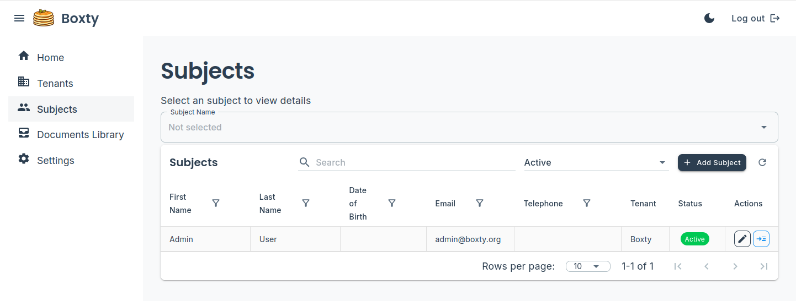
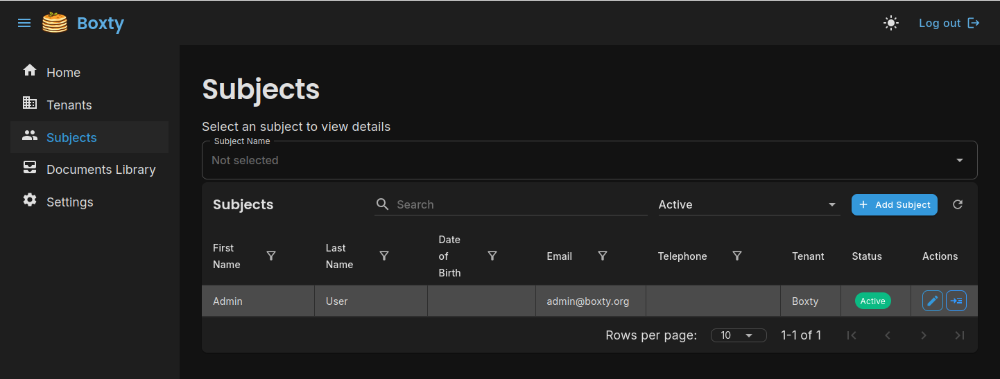

# Boxty Demo

A full-stack multi-tenancy and multi role user account capable application built with .NET and Blazor WebAssembly. Uses Keycloak for authentication and authorisation.

## Screenshots

<table>
  <tr>
    <td></td>
    <td></td>
  </tr>
  <tr>
    <td align="center">Light Mode</td>
    <td align="center">Dark Mode</td>
  </tr>
</table>

## Getting Started

### Starting the Application

Start all services using Docker Compose:

```bash
docker compose up --build
```

This will:
- Build and start the client application (Blazor WebAssembly)
- Build and start the server application (ASP.NET Core API)
- Start all dependent services (database, etc.)
- Enable hot reload for automatic updates during development

**Note:** Make sure Docker Desktop (or Docker Engine) is running before executing the docker compose command.

### Restarting Individual Services

To rebuild and restart a specific service:

```bash
# Restart the client only
docker compose up --build chapp.client

# Restart the server only
docker compose up --build chapp.server
```

## Stopping the Applications

Press `Ctrl+C` in the terminal, or run:

```bash
docker compose down
```

## Project Structure

```
Boxty/
├── Boxty/
│   ├── ClientApp/          # Blazor WebAssembly client
│   ├── ServerApp/          # ASP.NET Core API server
│   └── SharedApp/          # Shared DTOs and models
└── Boxty/     # Base framework components
    ├── ClientBase/         # Reusable client components
    ├── ServerBase/         # Reusable server components
    └── SharedBase/         # Shared base models
```

## Prerequisites

- [.NET SDK](https://dotnet.microsoft.com/download) (version 8.0 or later)
- [Docker Desktop](https://www.docker.com/products/docker-desktop) or Docker Engine
- [Docker Compose](https://docs.docker.com/compose/) (usually included with Docker Desktop)
